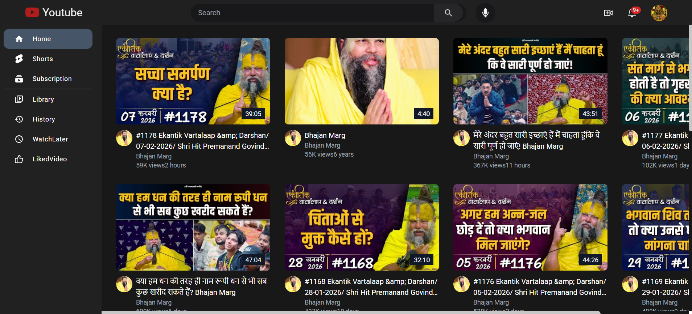
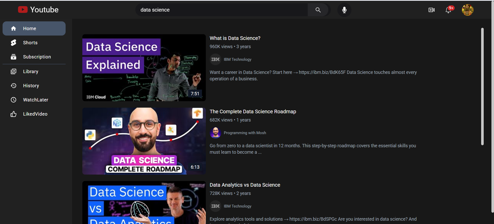
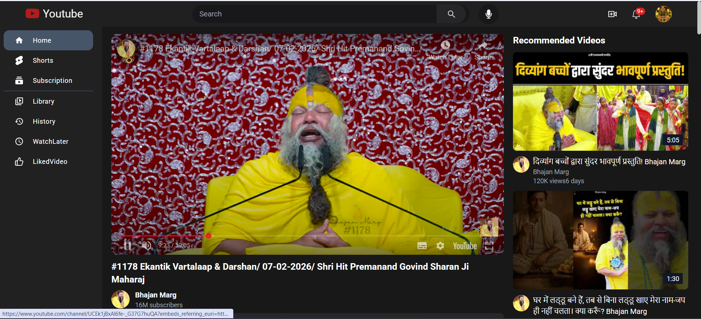
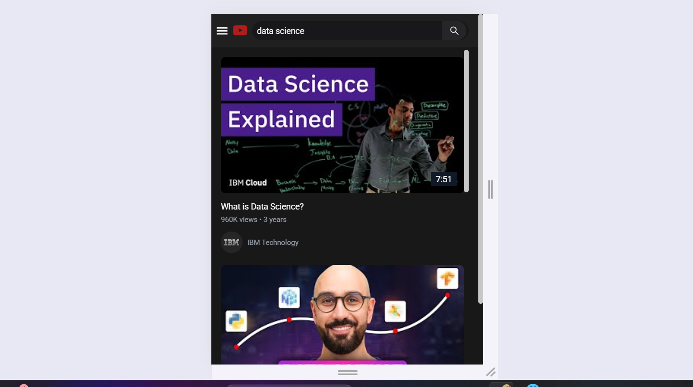
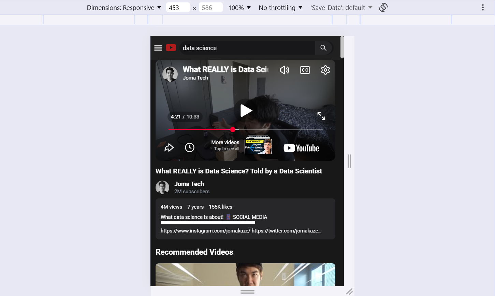

# 🎬 YouTube Clone – Production Ready React Application

A modern, production-ready **YouTube Clone** built with **React** that consumes live data from the **YouTube Data API v3**.  
This project demonstrates real-world frontend development practices including state management, API integration, environment security, and cloud deployment.

🌐 **Live Demo:** https://youtube-clone-15ca.onrender.com  
📂 **Source Code:** https://github.com/Ajayprajapati0253/youtube-clone

---

## ✨ Key Features

- 🔍 Real-time video search
- 📺 Video playback with details
- 📃 Dynamic video feed
- ⚡ Fast & responsive UI
- 🧠 Centralized state management
- 🔐 Secure API key handling
- 🚀 Cloud deployment

---

## 🛠️ Tech Stack

| Category | Technology |
|-------|-----------|
| Frontend | React (Create React App) |
| State | Redux Toolkit |
| Styling | Tailwind CSS |
| API | YouTube Data API v3 |
| HTTP | Axios |
| Deployment | Render (Static Site) |

---

## 🏗️ Architecture Overview

- Component-based UI design
- Redux slices for predictable state flow
- API abstraction using Axios
- Environment-based configuration
- Static site hosting with CDN

---

## 📁 Folder Structure

youtube-clone/
├── public/
├── src/
│  ├── components/
│  ├── redux/
│  ├── pages/
│  ├── utils/
│  └── App.js
├── .env.example
├── package.json
└── README.md

---

## 🔐 Environment Variables

Create a `.env` file in the root directory and add your YouTube API key:

```env
REACT_APP_YOUTUBE_DATA_API_KEY=your_api_key_here
```

---

## 📸 Screenshots

### 🏠 Home Page


### 🔍 Search Results


### ▶️ Watch Page (Desktop)


### 📱 Home Page (Mobile)


### 📱 Watch Page (Mobile)

